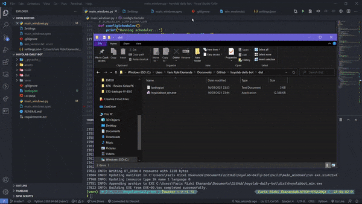

# Genshin Hoyolab Daily Check-in Bot 📜🖋
Genshin Impact's Hoyolab Daily Check-in Bot is here! The concept is simple, **run once, run forever**. You only need to run the scheduler once, then it will continue to run the claim script once daily, forever!

Outdated demo:



> #### Disclaimer: Scheduler only for Windows 

# Features 🃏
- Windows Scheduler to run claim daily, automatically
- Claim script

# Prerequisites 🎯
- Login to mihoyo's website at any browser (A login for a year is enough)

# How to use ✨
TBA

# Configuration File (v1.1.5+)
- **COOKIE_BROWSER**: You can target specific browser to be used for login. Please beware that this program doesn't support account chooser yet, so if you have multiple account you may use a browser you rarely use that only contains 1 account information.  
Currently supported browsers are: `firefox`, `chrome`, `chromium`, `opera`, and `edge`. The default is `all`.
- **DELAY_MINUTE**: Sometimes, your PC is some minutes earlier than the server time. If you're experiencing reward already claimed whenever the bot started, please add some delay.
- **RANDOM_DELAY_MINUTE**: Range in minutes for randomizing bot scheduler. Default is `60` (means the bot will starts delayed randomly within 1 hour after daily reset).
- **SCHEDULER_NAME**: The name of the bot scheduler. With this, you can have multiple bot scheduled with different configurations. For example, in one folder the bot is configured to login from chrome, while the other one is configured to login from firefox. The default is "HoyolabCheckInBot".
- **ACT_ID** and **COOKIE_DOMAIN_NAME** shouldn't need changing. They are present for futureproofing.

# How to update 📈
TBA

# Development Setup
1. `git clone` the repository.
2. `cd hoyolab-daily-bot`
3. Setup Python 3.11 virtualenv
   ```
   pip install virtualenv
   python -m venv venv
   venv\Scripts\activate
   ```
2. Install dependencies
   ```
   pip install -r requirements.txt
   ```
3. Run `python -m hoyolab_daily_bot.scheduler` to run the scheduler.
Run `python -m hoyolab_daily_bot.claim` to claim today's rewards only. 
